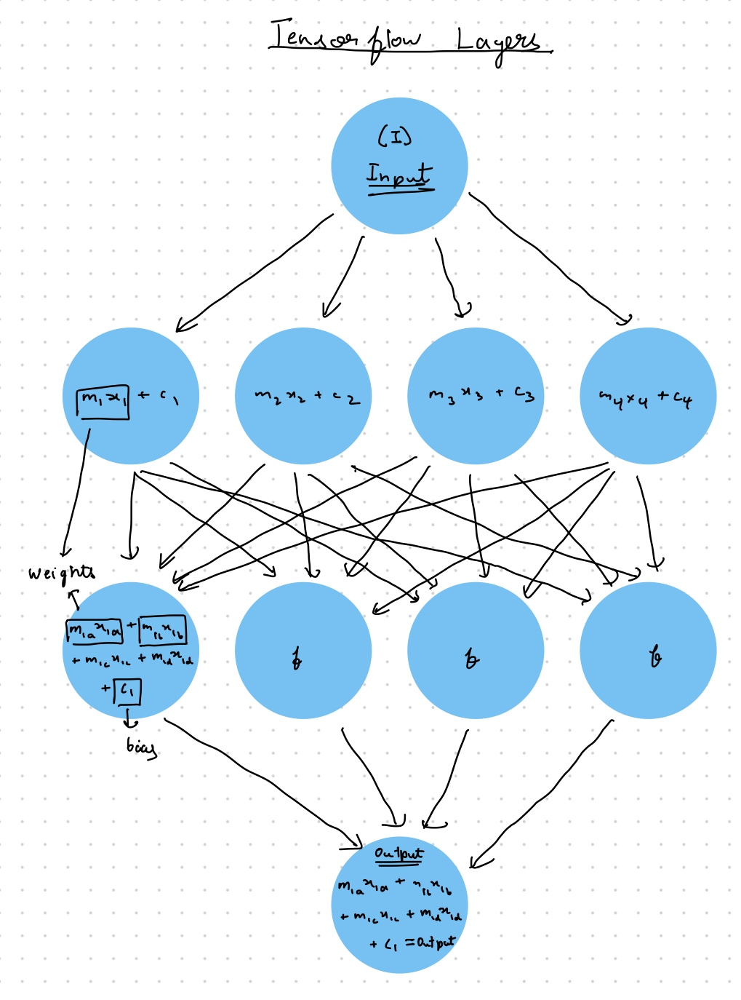

# Machine Learning

In this repo I will be updating all the programs that I write using my Journey of Learning machine learning on Tensorflow. Some basic consepts are shown on this readme.

## Weights and Biasis

Weights and Biasis are for basically the number of variables and constants made in each layer during the training process of the model.
